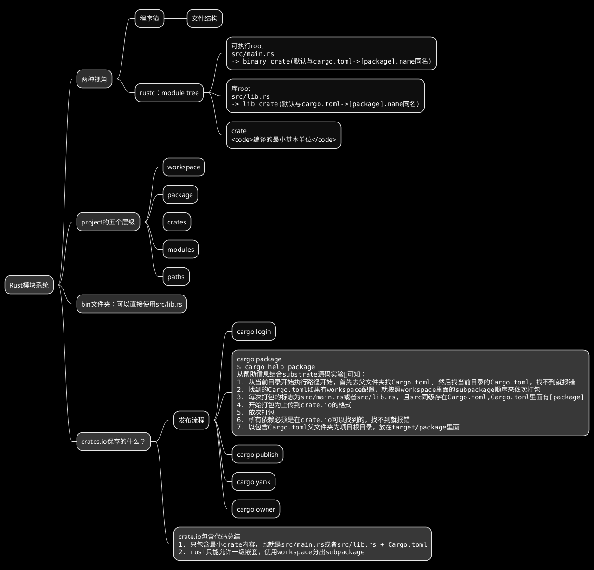
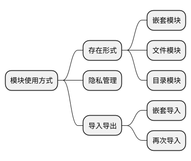

# 模块系统相关：Workspace、Package、Crate、Module

<!--ts-->


<!-- Created by https://github.com/ekalinin/github-markdown-toc -->
<!-- Added by: kuanhsiaokuo, at: Sun Jul 10 18:48:27 CST 2022 -->

<!--te-->

## 厘清Workspace、Package、crate和module的关系

### Package: 包含Cargo.toml

package就是cargo new的产物，里面包含一个cargo.toml，包名就写在里面的package里。比如substrate的一个包代码：

> [substrate/Cargo.toml at master · paritytech/substrate](https://github.com/paritytech/substrate/blob/master/client/allocator/Cargo.toml)

```toml
[package]
name = "sc-allocator"
version = "4.1.0-dev"
authors = ["Parity Technologies <admin@parity.io>"]
edition = "2021"
license = "Apache-2.0"
homepage = "https://substrate.io"
repository = "https://github.com/paritytech/substrate/"
description = "Collection of allocator implementations."
documentation = "https://docs.rs/sc-allocator"
readme = "README.md"

[package.metadata.docs.rs]
targets = ["x86_64-unknown-linux-gnu"]

[dependencies]
log = "0.4.17"
thiserror = "1.0.30"
sp-core = { version = "6.0.0", path = "../../primitives/core" }
sp-wasm-interface = { version = "6.0.0", path = "../../primitives/wasm-interface" }
```

1. package表明该package的基本信息
2. dependencies表示该package依赖的其他package

### workspace与package

- workspace+members: 并发代表当前package包含的所有subpackage，只是指明一个工作区的所有package

> A Cargo.toml file can simultaneously define a package and a workspace to which it belongs, but that package is still a member of that workspace, not the other way around.

### 具体对比package和crate

```admonish tip title='package和crate'
在rust中，最小编译单元叫crate，package是一个或多个crate的集合。
> 也就是说，如果package没有指明crate，本身就是一个crate
```

#### 在Cargo.toml的[bin]/[lib]中指明

### 再来对比workspace、package和crate

```admonish info title='hierarchy'
Workspace → Package → Crate
```

Generally, a package exposes only one crate. Most library crates don't even have an associated binary crate(s) in their
package. It's due to this that package/crate terminology is often used interchangeably; for lib crates it is in the 90%
case. Package is also a generic term that people not familiar with Rust's ecosystem can understand, where crate is a
Rust-specific piece of jargon.

The two concepts are still meaningfully different -- while conventionally package and lib crate have the same name (
modulo hyphens vs underscores), this is not required in any way -- but for the most part there isn't an appreciable
difference unless you're paying attention to the weeds and edge cases.

### module

在rust中，module(模块)更多还是一种逻辑上的概念，主要使用mod关键字，下面会具体说说

```admonish tip title='模块主要还是为了控制作用域(scope)和隐私(privacy)'

```

```rust
mod say {
    pub fn hello() {
        println!("Hello, world!");
    }
}
```

### 整理说一下rust的模块系统



### 联想对比

1. golang的模块系统
2. python/js的模块系统
3. mdbook的所有文章只能挂到SUMMARY才能生成链接。

### module tree

- module Tree只有一个入口（根），src/main.rs或src/lib.rs
- 默认情况下，lib.rs和main.rs的crate都和cargo.toml里面的[package].name同名
- 但是cargo.toml里面可以给crate重命名：[lib]重命名lib.rs, [binary]重命名main.rs
- crate.io上面的名字还有优先级：[lib]->src/lib.rs > [package]/name.
  比如这里：[aHash/Cargo.toml at master · tkaitchuck/aHash](https://github.com/tkaitchuck/ahash/blob/master/smhasher/ahash-cbindings/Cargo.toml)
  . cargo search ahash-cbindings没有结果，cargo search ahash_c就有返回

## 模块呈现方式

### 嵌套模块

### 文件模块

### 目录模块

## 隐私与导入导出

### 隐私管理

### 嵌套导入

### 再次导出

```admonish info title="pub(crate) fn fn_name() {}"
Rust 中元素的隐私性是从模块层面开始的。作为程序库的作者,要从模块向用户公开一些内容可以使用关键字 pub。

> 但是对于有一些元素,我们只想暴露给软件包中的其他模块,而不是用户。

在这种情况下,我们可以对元素使用 pub(crate)修饰符,这允许元素仅在软件包内部暴露
```

## 参考资源

```admonish hot title='不要把其他人的话直接照抄！'
保持批判，有所取舍，知行合一, 方见真我
```

### online-book

- [Visibility and privacy - The Rust Reference](https://doc.rust-lang.org/stable/reference/visibility-and-privacy.html)
- [pub(in path), pub(crate), pub(super), and pub(self) - The Rust Reference](https://doc.rust-lang.org/stable/reference/visibility-and-privacy.html#pubin-path-pubcrate-pubsuper-and-pubself)
- [Managing Growing Projects with Packages, Crates, and Modules - The Rust Programming Language](https://doc.rust-lang.org/book/ch07-00-managing-growing-projects-with-packages-crates-and-modules.html)
- [Modules - Rust By Example](https://doc.rust-lang.org/stable/rust-by-example/mod.html)
- [Crates - Rust By Example](https://doc.rust-lang.org/stable/rust-by-example/crates.html)

### fragment

- [了解下Rust 模块使用方式](https://web.archive.org/web/20220620093333/https://mp.weixin.qq.com/s/mQ0zh_tcLEZZNpGIbz6BVA)
- [Confused about Package vs. Crate terminology. : rust](https://www.reddit.com/r/rust/comments/lvtzri/confused_about_package_vs_crate_terminology/)
- [包和模块 - Rust语言圣经(Rust Course)](https://course.rs/basic/crate-module/intro.html)
    - 项目(Packages)：一个 Cargo 提供的 feature，可以用来构建、测试和分享包
    - 包(Crate)：一个由多个模块组成的树形结构，可以作为三方库进行分发，也可以生成可执行文件进行运行
    - 模块(Module)：可以一个文件多个模块，也可以一个文件一个模块，模块可以被认为是真实项目中的代码组织单元

- [Workspaces - The Cargo Book](https://doc.rust-lang.org/cargo/reference/workspaces.html)
  默认情况下，一个Cargo.toml只能指明一个package，但是在workspace里面就可以指明多个(此时可以理解为这个package包含多个subpackage)，比如substrate的根cargo：
- [substrate/Cargo.toml at master · paritytech/substrate](https://github.com/paritytech/substrate/blob/master/Cargo.toml)

```toml
[workspace]
resolver = "2"

members = [
    "bin/node-template/node",
]
[profile.dev.package]
blake2 = { opt-level = 3 }
```

- [Cargo Targets - The Cargo Book](https://doc.rust-lang.org/cargo/reference/cargo-targets.html?highlight=bin#library)

```admonish tip title='crate'
A crate is the [lib] or [[bin]] tables in the Cargo.toml. 
At most one lib crate may be present, but an arbitrary number of bin crates may be present. 

You won't see these tables added explicitly too often, 
because they're implicitly present if you have src/lib.rs (lib crate) and/or src/main.rs (bin crate).
```

```toml
# Example of customizing the library in Cargo.toml.
[lib]
crate-type = ["cdylib"]
bench = false
```

```toml
# Example of customizing binaries in Cargo.toml.
[[bin]]
name = "cool-tool"
test = false
bench = false

[[bin]]
name = "frobnicator"
required-features = ["frobnicate"]

```

- [Packages and Crates - The Rust Programming Language](https://doc.rust-lang.org/book/ch07-01-packages-and-crates.html)

```admonish quote title='《The Rust Programming Language》相关整理'
1. 一个包是一个或多个提供一组功能的 crates。一个package包含一个 Cargo.toml 文件，该文件描述了如何构建这些crate。
2. crate 可以是二进制 crate 或库 crate。
- 二进制 crate 是可以编译成可执行文件的程序，可以运行，例如命令行程序或服务器。
> 它们必须有一个名为 main 的函数，该函数定义了可执行文件运行时会发生什么。到目前为止，我们创建的所有 crate 都是二进制 crate。
3. 库 crates 没有 main 函数，它们不会编译为可执行文件。它们定义了旨在与多个项目共享的功能。
> 例如，我们在第 2 章中使用的 rand crate 提供了生成随机数的功能。
4. 下面是一些规则：
- 一个包最多可以包含一个库 crate。它可以包含任意数量的二进制 crate，但它必须至少包含一个 crate（库或二进制）。
- 当我们输入**cargo new**时，Cargo 创建了一个 Cargo.toml 文件，cargo将会给我们一个package。
- 查看 Cargo.toml 的内容，没有提到 src/main.rs，因为 Cargo 遵循一个约定，即 src/main.rs 是与包同名的二进制 crate 的 crate 根。
- 同样，Cargo 知道如果包目录包含 src/lib.rs，则该包包含一个与包同名的库 crate，并且 src/lib.rs 是它的 crate 根。 
> Cargo 将 crate 根文件传递给 rustc 以构建库或二进制文件。
- 在这里，我们有一个只包含 src/main.rs 的包，这意味着它只包含一个名为 my-project 的二进制 crate。
- 如果一个包包含 src/main.rs 和 src/lib.rs，它有两个 crate：一个二进制文件和一个库，两者都与包同名。
> 通过将文件放在 src/bin 目录中，一个包可以有多个二进制 crate：每个文件都是一个单独的二进制crate
```

- [Rust的模块化系统: 包Packages, 箱Crates, 和模块Modules - 知乎](https://web.archive.org/web/20220704161217/https://zhuanlan.zhihu.com/p/106251259)
  包 Packages: Cargo提供的让我们创建, 测试和分享Crates的工具. 箱 Crates: 提供类库或可执行文件的模块树 模块 Modules and use: 管理和组织路径, 及其作用域和访问权限 路径 Paths:
  如结构体(structs), 函数(function), 或模块(module)等事物的命名方式


- [三言两语理解Rust module System - 知乎](https://web.archive.org/web/20220704161255/https://zhuanlan.zhihu.com/p/365735504)

Module System

一个问题几乎总会由许多小问题组成。module system是为了定义清楚各个小问题的边界。这样更容易和更方便的管理问题。而大问题的解法，就是把小问题的解法组合起来。

project，package， crate， module这些概念感觉相似。实际上，一个package/project可以包含多个 binary crates和一个或者零个library
binary。一个crate可以包含多个module。可以认为package就是一个project，一个crate就是一个暴露给外界的逻辑单元，一个module就是一个小问题的解法。

当project里面有lib.rs说明这个project是一个library crate，这个library的名字是project的名字。main.rs/main2.rs都可以直接使用这个library
crate。我们可以认为bin文件夹里面是单独的crate，它们默认导入了这个library crate。

一个crate就是一个暴露给外界的逻辑单元，一个module就是一个小问题的解法

关于找不到模块： 这就是module tree的体现，**be explicit**。所有模块都需要添加到crate root(src/main.rs或者src/lib.rs)里面。也就是要显示地指明module
tree的结构。这也就是我们经常在main.rs/lib.rs里面看到许多mod xxx的原因。比如[这里的代码](https://github.com/Celthi/rsnova/blob/master/src/lib.rs#L20)

它们的存在就是为了将project里面的modules 加到这个crate里面。比如在main.rs 里面看到mod channel，就是将module channel加进crate的module tree来。

相关引用：
[Mentally Modelling Modules - In Pursuit of Laziness](https://web.archive.org/web/20220419042941/https://manishearth.github.io/blog/2017/05/14/mentally-modelling-modules/)

- [Clear explanation of Rust’s module system](https://web.archive.org/web/20220614192155/https://www.sheshbabu.com/posts/rust-module-system/)
  作者通过举例，详细介绍了rust编译器与程序猿看到的不同项目结构。


- [Rust那些难理解的点(大量更新于6月16日） - 知乎](https://web.archive.org/web/20220704161820/https://zhuanlan.zhihu.com/p/360342782)

- [The confusion around Rust's modules reminds me of the different ways that people... | Hacker News](https://web.archive.org/web/20220704162217/https://news.ycombinator.com/item?id=23894172)
  The confusion around Rust's modules reminds me of the different ways that people learn how to use car indicators. Some
  people learn that you push the stalk up to indicate your intent to turn left, or down to turn right. And then they
  might eventually learn that in a European car, you push the stalk down to turn left, and up to turn right. And then of
  course some of these people get confused when switching between different cars. Yes, I've seen plenty of people on the
  road who indicate one direction and then turn another. It's... kind of frightening .

The other way of learning to use car indicators is much simpler: push the stalk in the direction that you would turn the
wheel. Of course this still leaves the possibility that some people will push the wrong stalk, and briefly activate
their windshield wipers . But it's a much easier mistake to _notice_, and the consequences are minor.

Back to Rust's modules. I keep seeing articles trying to offer a simple or clear explanation of how they work, that end
up unnecessarily complicated in a way that feels a lot like the "up/down" model of car indicators. The explanation that
makes the basics of Rust modules clear to me is this:

- Child modules must always be _declared_ in the parent module, or they don't exist.

- The content of child modules may be _defined_ either inline in the parent as `mod child { ... }`, or in a file with a
  relative path of './child.rs' or './child/mod.rs'.

Did I miss anything important?

Without this basic explanation up-front, I have no idea what to do with the stream of information I'm reading in a
lengthy article on the topic -- I've been given no scaffolding onto which to bolt all the details and examples. So this
is the "bottom line" that I would like to see "up front" in descriptions of Rust's modules.

Other misunderstandings, e.g., around item visibility, are explained really well by the compiler if you get them mixed
up, so I'm not sure how much value there is in mixing them in to articles about how modules are _structured_ before
those two basic facts are presented.

- [How to better understand Crate in Rust? - Stack Overflow](https://web.archive.org/web/20220705022801/https://stackoverflow.com/questions/63515853/how-to-better-understand-crate-in-rust)

> The processing of that source file may result in other source files being loaded as modules.
> It is not that one source file makes up a crate: it's that starting from that one source file, you can find all the files making up the crate, as opposed to other compilation models where the compiler might be given many file names to start from.


其实从代码完整性考虑，crate确实就是编译的最小基本单位。因为它不仅指一个源码文件(xx.rs)，而是包含这个源码文件里面引入的所有其他module。这个时候，rustc才会开始编译这个crate

- [rust - What exactly is a 'crate' in the Cargo ecosystem and what is the mapping to what is on crates.io? - Stack Overflow](https://web.archive.org/web/20220609151503/https://stackoverflow.com/questions/52024304/what-exactly-is-a-crate-in-the-cargo-ecosystem-and-what-is-the-mapping-to-what?rq=1)

> The exact things hosted on crates.io are crates inside packages. A crate is the output artifact of the compiler.
> The compilation model centers on artifacts called crates. Each compilation processes a single crate in source form, and if successful, produces a single crate in binary form: either an executable or some sort of library.
> A package is an artifact managed by Cargo, the Rust package manager.

### local

- [<精通Rust(第二版)>-2.2模块](marginnote3app://note/CF61A2D3-C05C-49B2-943A-777D4A4A6434)
- [<精通Rust(第二版)>-7.9 模块、路径和导入](marginnote3app://note/72AB7939-56B0-4797-8307-09E7F9905417)
